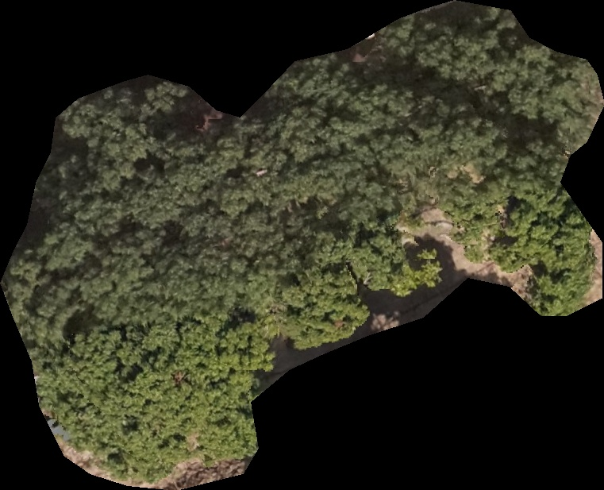

基于无人机多光谱遥感图像的荔枝冠层分类
===

数据
---
### 原始数据
RGB + 其他5种光谱 的荔枝树图像, 由无人机拍摄拼接而成, 呈现一大个荔枝树区域.

### 前期处理
使用labelme对一颗颗树进行标记, 然后使用坐标切割出一个多边形图像, 放入到一个图像中, 多边形外区域用黑色填充.

分类使用其黄化程度作为标准分为4类(0%, 10~20%, 50~60%, 80%以上)

|  |  |  |  |
|:--------------------------:|:------------------------------:|:-----------------------------:|:---------------------------:|

### 后期处理
以rgb为基础, 5种不同的光谱进行不同的组合排列, 得到不同通道数的多个数据集

对其进行翻转等数据扩充等操作

深度学习
---

### 网络
前期使用不同的网络进行测试学习, 看看哪个网络好, 有mobilenet, resnet50, vgg16, vit

最终得到的结果是resnet50效果最好

### 过程
在训练时使用不同的通道组合进行训练, 得到6通道一个组合效果最好, 达到99.25%的水平, 具体参数在这里不作记录

每次用不同通道的数据集要在相应文件中更改通道数(dataloder, 网络文件等)

代码
---
都是自己网上学习, 或者寻找, 或是他人给予的~

自己学习后进行相应修改, 有些代码比较个性

_通道修改只需要搜索通道修改就可以找到哪里要修改(好像是)_

rgb版本的在分支里嗷(那个我只是用用几次, 和我没多大关系, 大部分是网络上可以找到的)

  /\\_/\  
 ( o.o ) 

 > ^ <

  /\\_/\  
 ( o.o ) 

 > ^ <

  /\\_/\  
 ( o.o ) 

 > ^ <

  /\\_/\  
 ( o.o )

 > ^ <

> 学习经验, 而不是贪欲功名

